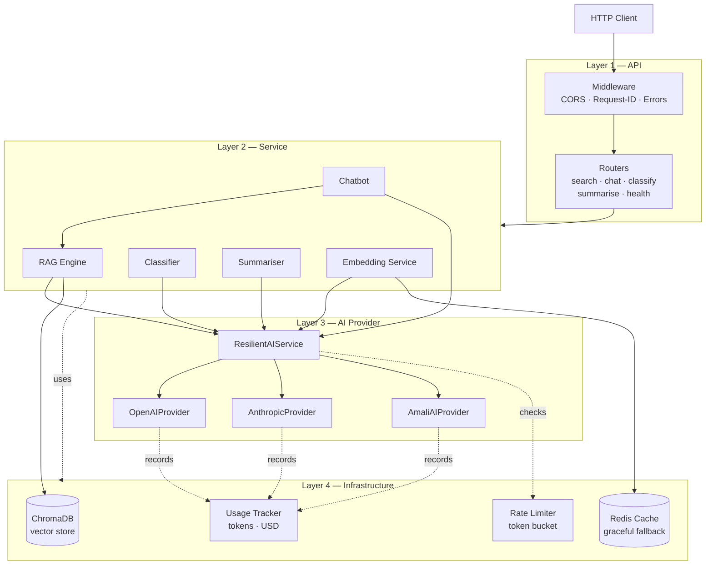
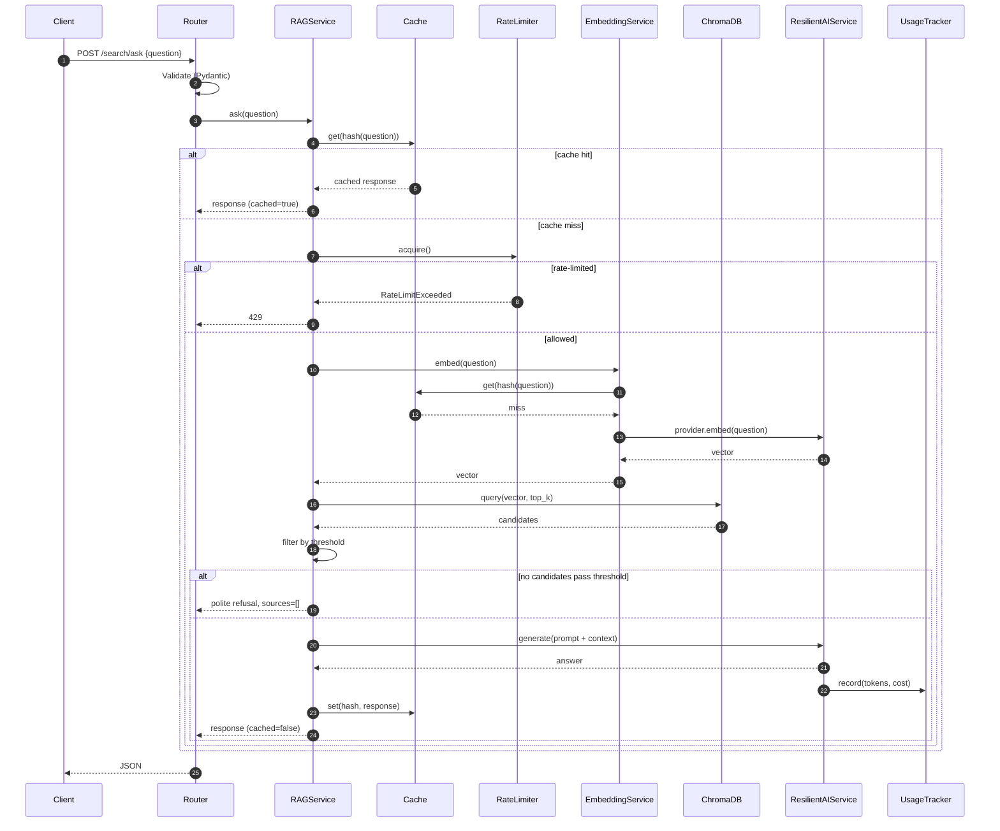

# Architecture — LibraryMind

## 1. Architectural Style

LibraryMind uses a strict four-layer architecture: **API → Service → AI Provider → Infrastructure**. Each layer depends only on the layer below; reverse imports are forbidden. The pattern is conventional for stateless, request/response backends and offers three practical benefits for this lab: each layer is independently testable (mock the AI provider once and you've made every service testable), business logic is sealed away from transport details (so the same service could be exposed over gRPC or a CLI without change), and vendor dependencies are isolated to one layer (swapping OpenAI for Anthropic is a single-file change).

We chose a layered architecture over alternatives — hexagonal/ports-and-adapters, clean architecture, vertical slices — because the lab is small enough that the extra ceremony of hexagonal architecture would be noise, but big enough that vertical slices would scatter cross-cutting concerns. Layered is the right point on the curve.

Scalability considerations: every layer is stateless except for the in-memory stores in the infrastructure layer (rate limiter token bucket, usage records, conversation history). Those are intentionally process-local because the lab assumes single-instance deployment; the abstractions wrap them so a Redis-backed implementation is a swap-not-rewrite when horizontal scaling matters. ChromaDB is embedded in-process; a future deployment would point at a remote Chroma server with no API change.

## 2. Architecture Diagram



## 3. Folder Organisation

The repository is laid out as follows. Module responsibilities are stated in each `__init__.py`; this section is the executive summary.

```
library-mind/
├── app/
│   ├── api/              # Layer 1: FastAPI routers (one per domain)
│   ├── services/         # Layer 2: business orchestration
│   ├── providers/        # Layer 3: AI vendor abstractions + failover
│   ├── infrastructure/   # Layer 4: cache, rate limiter, usage tracker, vector store
│   ├── schemas/          # Pydantic request/response models
│   ├── core/             # Settings, structured logging, exception hierarchy
│   ├── data/             # Seed catalogue (books.json)
│   ├── main.py           # FastAPI application factory
│   └── __main__.py       # `python -m app` entrypoint
├── scripts/              # Seeding & smoke-test scripts
├── tests/                # Pytest suite
├── docs/                 # PRD, ERD, API reference, this file
├── frontend/             # Placeholder for the future React client
├── .github/workflows/    # CI definitions
├── docker-compose.yml    # Local dev stack (api + redis)
├── Dockerfile            # Multi-stage container build
├── Makefile              # Developer task runner
└── pyproject.toml        # Deps, build, lint, type, test config
```

Tests mirror the package structure (`tests/services/test_rag.py` exercises `app/services/rag.py`). Documentation lives in `docs/` and is the source of truth — code disagreements with these documents are bugs in the code, not the docs.

## 4. Request Flow

The canonical request — a patron asking *"recommend a book about space exploration"* via `POST /search/ask` — flows through every layer.



The chatbot path is identical except the chatbot service also retrieves and truncates conversation history before constructing the prompt, and appends the user message and assistant reply to the conversation store after success.

## 5. Service Boundaries

`RAGService` knows nothing about HTTP or about providers; it accepts a question and returns a structured result. `ChatbotService` depends on `RAGService` for retrieval; it does not duplicate that logic. `EmbeddingService` is shared between RAG and any other consumer that needs vectors, because embedding is the most cache-worthy operation in the system. `ClassifierService` and `SummariserService` consume only the AI provider layer — they do not touch the vector store because their inputs are self-contained.

The provider layer exposes a single `AIProvider` protocol with one method (`generate(prompt, system, temperature, max_tokens)`); each concrete provider implements it. `ResilientAIService` is a *decorator* over a list of providers — it satisfies the same protocol, so callers cannot tell whether they are talking to one provider or to a fallback chain. This is the point of using protocol-based dependencies: substitution is free.

## 6. Validation Flow

Validation happens in three concentric rings. The outermost ring is Pydantic at the router boundary: type coercion, length limits, enum membership. The middle ring is service-layer validation: invariants that cannot be expressed in a schema, like "rate limit not exceeded" or "embedding model still matches the seed". The innermost ring is provider-layer validation: provider-specific concerns like token-limit checks before dispatching. Failures at each ring map to a clear exception (`ValidationError`, `RateLimitExceededError`, `ProviderError`) and the global exception handler in the API layer translates each to the correct HTTP status.

## 7. Authentication Flow

Out of scope for this lab — no endpoint is protected. The architecture is auth-ready: middleware would sit between CORS and the routers, populating `request.state.user` from a verified JWT. Routers would consume that via a `Depends(get_current_user)` dependency. Per-user rate limiting would key the token bucket on user ID. None of this is implemented now; the placeholder is `app/api/` middleware ordering, which already reserves a slot above routers for auth.

## 8. Model Integration Approach (ORM/Data Layer)

There is no SQL ORM in this lab because there is no SQL database. The catalogue lives in ChromaDB, accessed via a thin `VectorStore` wrapper that hides ChromaDB's specific API. Conversation, ticket, and usage records live in plain Python data structures behind narrowly-scoped store classes (`ConversationStore`, `UsageTracker`). The store classes are designed as interfaces with a single in-memory implementation today; future Postgres-backed implementations would satisfy the same interface and require no service-layer changes.

## 9. Async Processing Design

There is no background-task system in this lab because no operation needs to outlive the request: embeddings, RAG answers, and classifications are all synchronous from the user's perspective. FastAPI handlers are declared `async def` so they don't block the event loop on I/O (provider calls are awaited with the async clients each SDK ships), but there is no Celery, RQ, or APScheduler.

If a future iteration needed background work — pre-computing embeddings for newly ingested books, periodically rolling up usage records — the natural fit would be Celery with Redis as the broker (Redis is already in the stack). The seeding script would dispatch ingest tasks, and a worker process would consume them. Until that need exists, adding a task queue would be over-engineering.

## 10. Caching Strategy

Three caches sit on the hot path. The **embedding cache** keys on the hash of the input text and stores the resulting vector; this is the highest-value cache because embedding the same query twice produces the same vector deterministically. The **RAG response cache** keys on the hash of the question and stores the full answer + sources payload; this is what makes "same question asked twice returns instantly" measurable. The **classifier/summariser caches** key on the hash of the input text and store the parsed structured output; this matters less because user inputs are rarely identical, but it costs nothing.

All caches share the same Redis backend behind a single `Cache` wrapper class. The wrapper is designed so a `redis.ConnectionError` is logged and swallowed, returning `None` from `get` and silently no-op-ing on `set`. The application continues to function — slower, but correct — when Redis is down. This is the "degrade gracefully" requirement from the lab brief.

Cache TTLs are configurable; defaults are 1 hour for RAG responses and 24 hours for embeddings. Cache keys include a short version prefix (`v1:rag:...`) so prompt edits during development can be invalidated cleanly by bumping the prefix.

## 11. Observability

Structured logging is the foundation. Every log line is JSON in production and human-readable in development. Every log line associated with a request carries a request ID (generated in middleware in Phase 7 and bound to the structlog context for the lifetime of the request). Every AI call logs `provider`, `model`, `prompt_tokens`, `completion_tokens`, `cost_usd`, and `latency_ms`. Every cache lookup logs `hit | miss`. Every rate-limit decision logs `allowed | rejected`.

The `/health` endpoint exposes the running aggregate: daily cost in USD, total request count today, and the configured-provider list. This is the minimum viable telemetry for a lab. A production iteration would add OpenTelemetry traces (one span per layer), a Prometheus exporter for the usage tracker counters, and Sentry for unhandled exceptions. The seams for all three are present: the global exception handler is the natural Sentry insertion point, the usage tracker already aggregates the metrics Prometheus would scrape, and FastAPI/uvicorn integrate with OpenTelemetry through a single middleware addition.
